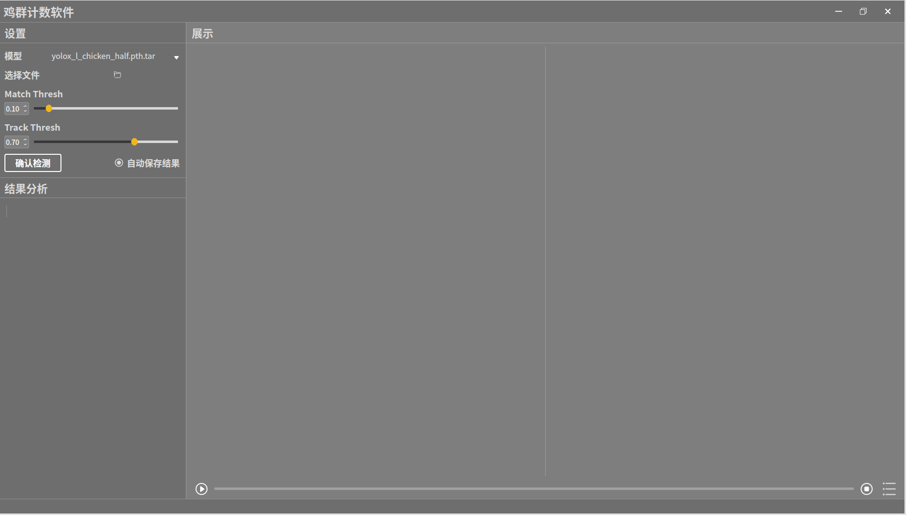

# 鸡群计数软件
软件已完成功能:
1. 选择模型功能
2. 选择视频文件
3. 改变conf或者nms阈值
4. 检测按钮
5. 播放与暂停
6. 结束观看
7. 数据统计
8. 保存检测视频功能
## 安装软件包
`pip install -r requirements.txt`

## 预训练模型

已经训练好的模型放置在**models**文件夹下面

## 运行程序
运行'`main.py`'

可在detect.py修改检测模块
## 界面截图
